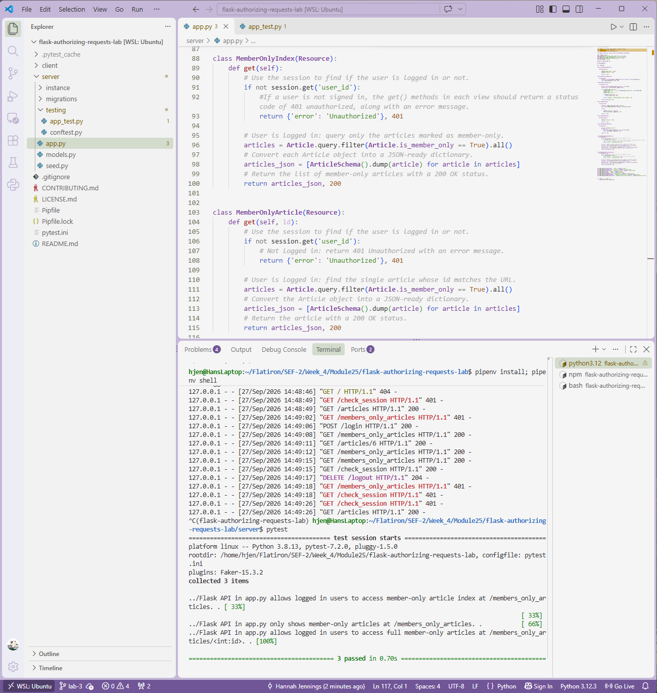

# Lab: Authorizing Requests
**Completed Sept 27, 2026** 

A Flask API and React blog app that restricts member-only articles to logged-in users. Visitors who are not signed in receive a `401 Unauthorized` response, and signed-in users can browse and read the full member-only content.
 

 
## Description
 
This project builds on a blog site that already has a basic login feature. It adds **authorization**, which controls what a user is allowed to access after they log in.
 
- **Authentication** answers "Who are you?" When a user logs in, the server stores their `user_id` in the Flask `session`.
- **Authorization** answers "Are you allowed to see this?" Before returning member-only content, the server checks the session for a logged-in user.
Each article has an `is_member_only` attribute. Two views, `MemberOnlyIndex` and `MemberOnlyArticle`, use a guard clause that checks `session.get('user_id')`. If no user is logged in, the view stops and returns an error with a `401` status. Otherwise, it returns the requested article data with a `200` status.
 
## Features
 
- Log in and log out using session-based authentication
- Session persistence across page refreshes
- Member-only article index that returns only articles where `is_member_only` is `True`
- Member-only article detail view that returns a single article by ID
- `401 Unauthorized` responses with an error message for users who are not logged in
- Page view limit on regular articles for visitors who are not logged in
## API Endpoints
 
| Method | Endpoint | Description | Auth Required |
| ------ | -------- | ----------- | ------------- |
| GET | `/articles` | List all articles | No |
| GET | `/articles/<id>` | Show one article (3-view limit when logged out) | No |
| POST | `/login` | Log in with a username | No |
| DELETE | `/logout` | Log out the current user | No |
| GET | `/check_session` | Return the currently logged-in user | Yes |
| GET | `/members_only_articles` | List all member-only articles | Yes |
| GET | `/members_only_articles/<id>` | Show one article by ID | Yes |
 
## Installation
 
Requirements: Python 3, Pipenv, Node.js, and npm.
 
From the project root folder:
 
```bash
pipenv install
pipenv shell
npm install --prefix client
cd server
flask db upgrade
python seed.py
```
 
## Usage
 
Start the Flask server from the `server` folder:
 
```bash
python app.py
```
 
The API runs on `http://localhost:5555`.
 
In a second terminal, start the React client from the project root folder:
 
```bash
npm start --prefix client
```
 
Log in with a seeded username to access the member-only articles. To find a username, run `flask shell` in the `server` folder and enter:
 
```python
User.query.first().username
```
 
## Running Tests
 
From the `server` folder, with the Pipenv shell active:
 
```bash
pytest -x
```
 
The test suite confirms that:
 
- Logged-in users can access `/members_only_articles` (200), and logged-out users cannot (401)
- `/members_only_articles` returns only member-only articles
- Logged-in users can access `/members_only_articles/<id>` (200), and logged-out users cannot (401)
## Technologies Used
 
- **Backend:** Python, Flask, Flask-RESTful, Flask-SQLAlchemy, Flask-Migrate, Marshmallow, SQLite
- **Frontend:** React
- **Testing:** pytest